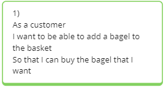
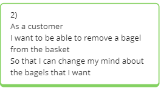

# Bob's Bagels Pair-Programming Project

## Domain Models

<b><i>User Story 1</i></b>
 
| Objects    | Properties     | Messages    | Output  |
| ---------- | -------------- | ----------- | ------- |
| Bagel      | - name @String | - getName() | @String | 
| Basket     | - contents @Array[@Bagel] | - addBagel(@Bagel) | @String |

<b><i>User Story 2</i></b>
 
| Objects    | Properties     | Messages    | Output  |
| ---------- | -------------- | ----------- | ------- |
| Bagel      | - name @String | - getName() | @String | 
| Basket     | - contents @Array[@Bagel] | - removeBagel(@Bagel) | @String |

<b><i>User Story 3</i></b> 
| Objects | Properties               | Messages             | Output   |
| ------- | ------------------------ | -------------------- | -------- |
| Bagel   | - name @String           | - getName()          | @String  |
| Basket  | - contents @Array[@Bagel]   - maxBasketSize @Int | - isBasketFull()       | @Boolean   |

<b><i>User Story 4</i></b> 
| Objects | Properties               | Messages        | Output   |
| ------- | ------------------------ | --------------- | -------- |
| Basket  | - maxBasketSize @Int | - increaseCapacity(@Int) | @Int |

<b><i>User Story 5</i></b> 
| Objects | Properties               | Messages        | Output   |
| ------- | ------------------------ | --------------- | -------- |
| Bagel   | - name @String           |                 | @String  |
| Basket  | - contents @array[@Bagel] | - removeBagel(@Bagel) | @String |

<b><i>User Story 6</i></b> 
| Objects | Properties               | Messages        | Output   |
| ------- | ------------------------ | --------------- | -------- |
| Bagel   | - name @String           |                 | @String  |
| Basket  | - contents @Array[@Bagel] | - addBagel(@Bagel) | @String |

<b><i>User Story 7</i></b> 
| Objects | Properties                | Messages           | Output  |
| ------- | ------------------------- | ------------------ | ------- |
| Bagel   | - price @Float            |  - getPrice()      | @Float  |

<b><i>User Story 8</i></b> 
| Objects | Properties     | Messages     | Output |
| ------- | -------------- | ------------ | ------ |
| Basket  | - total @Float | - getTotal() | @Float |
